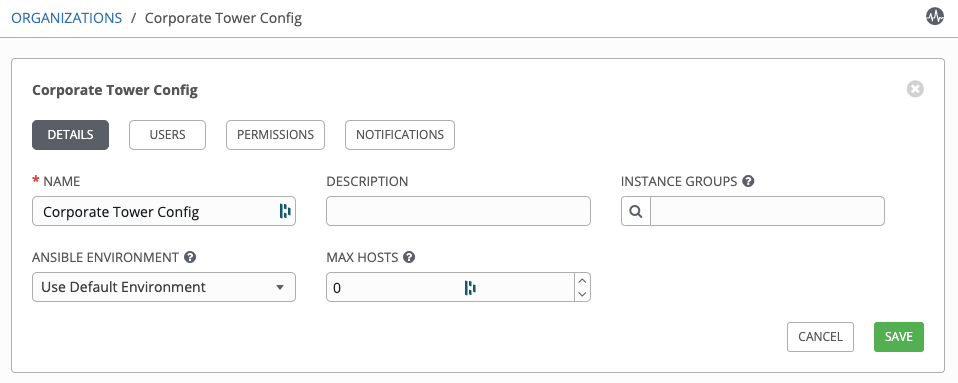
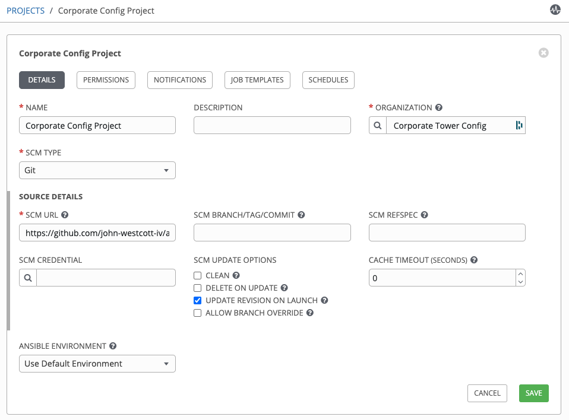
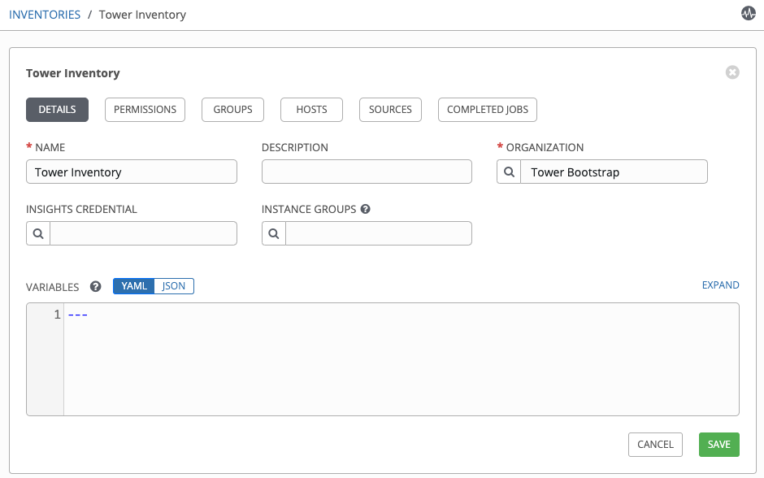
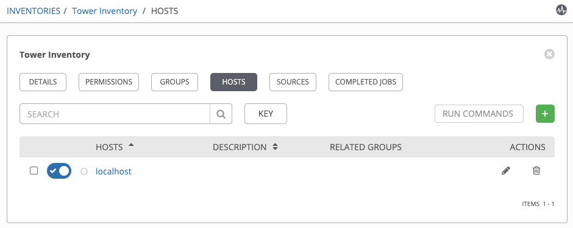
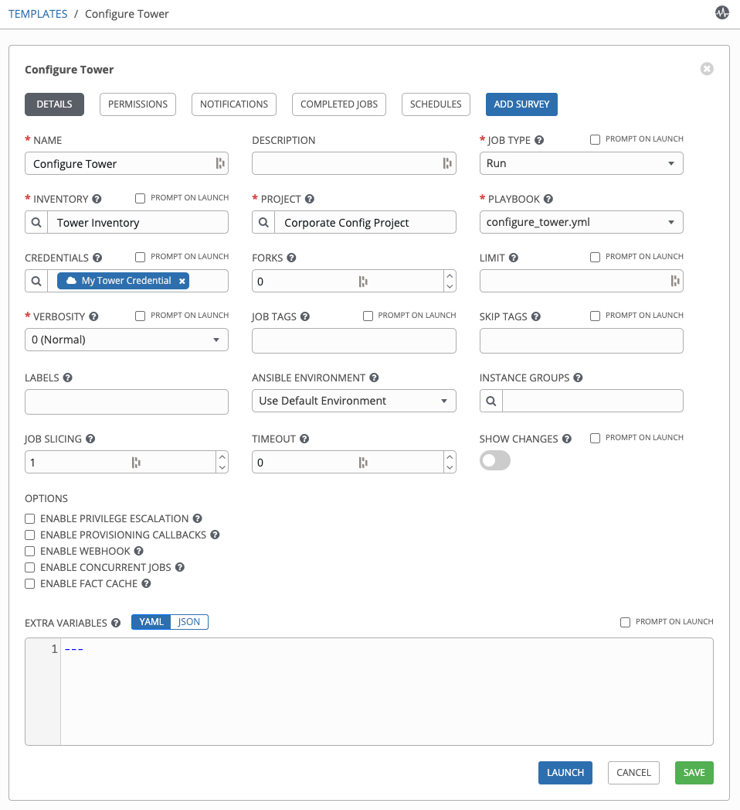
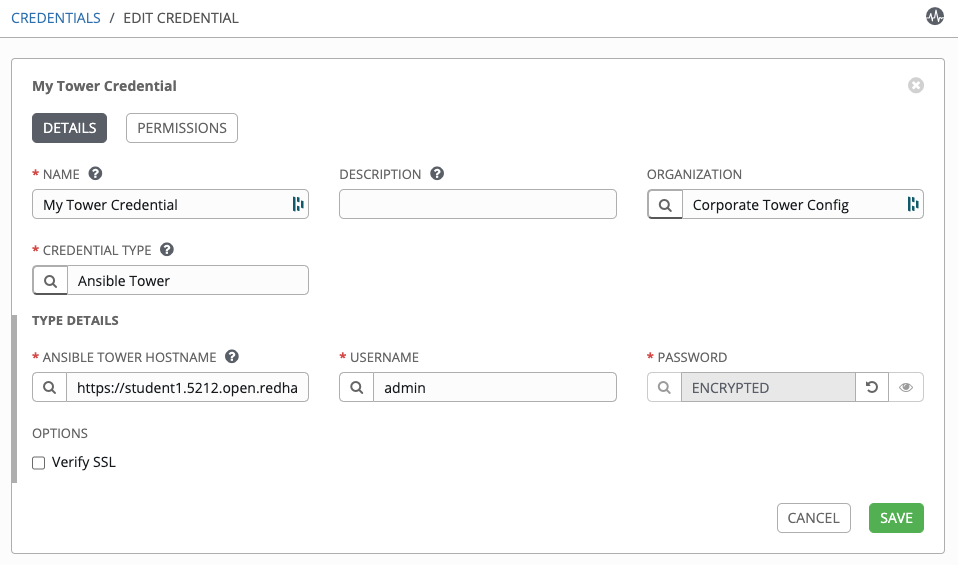

## Configuring Tower

For the rest of this lab, we need to build some assets in your Ansible Tower environment. Let's pretend that you are a new Ansible Tower administrator at your company. The previous administrator created a playbook which will configure an Ansible Tower instance per your company's specifications. While you could run this playbook from a command line, your preference is to run it from within the new Ansible Tower instance so that, if there are any updates, you can re-run the playbook to update the servers. The configuration playbook from the previous administrator is hosted in a GitHub repository and will create everything you need within your Ansible Tower instance. So we are going to write a playbook which will bootstrap your empty Ansible Tower instance, giving it access to the company's configuration script stored in GitHub. This bootstrap playbook will become part of your standard Ansible Tower installation process.


### Bootstrap Tower

To start, we are going to write a playbook very similar to our first playbook. Create a new file and call it `bootstrap.yml`, then paste in the following content:

```yml
---
- name: Bootstrap My Tower Instance For Corp Config
  hosts: localhost
  connection: local
  gather_facts: False
  collections:
    - awx.awx
  vars:
    org_name: "Corporate Tower Config"

  tasks:
    - name: Build Corporate Config Org
      tower_organization:
        name: "{{ org_name }}"

    - name: Create a project tied to gihub configuration
      tower_project:
        name: "Corporate Config Project"
        organization: "{{ org_name }}"
        scm_type: 'git'
        scm_url: 'https://github.com/john-westcott-iv/ansiblefest2020'
        scm_update_on_launch: true

    - name: Create an empty inventory
      tower_inventory:
        name: "Tower Inventory"
        organization: "{{ org_name }}"

    - name: Add our Tower host to the inventory
      tower_host:
        name: "localhost"
        inventory: "Tower Inventory"
        variables:
          ansible_connection: local

    - name: Create an Ansible Tower credential
      tower_credential:
        name: "My Tower Credential"
        organization: "{{ org_name }}"
        credential_type: "Ansible Tower"
        inputs:
          host: "{{ lookup('env', 'TOWER_HOST') }}"
          password: "{{ lookup('env', 'TOWER_PASSWORD') }}"
          username: "{{ lookup('env', 'TOWER_USERNAME') }}"

    - name: Create a job template for the configuration script
      tower_job_template:
        name: "Configure Tower"
        project: "Corporate Config Project"
        inventory: "Tower Inventory"
        playbook: "configure_tower.yml"
        job_type: "run"
        credentials:
          - "My Tower Credential"
```

As you can read in each task name, this playbook is going to create an organization, a project, an inventory (with a host), a credential, and a job template.

Now let’s execute our playbook with Ansible by running:

```
[student1@ansible-1 ~]$ ansible-playbook bootstrap.yml

PLAY [Bootstrap My Tower Instance For Corp Config] *****************************************************************************

TASK [Build Corporate Config Org] *****************************************************************************
[WARNING]: You are using the awx version of this collection but connecting to Red Hat Ansible Tower
changed: [localhost]

TASK [Create a project tied to gihub configuration] *****************************************************************************changed: [localhost]

TASK [Create an empty inventory] *****************************************************************************changed: [localhost]

TASK [Add our Tower host to the inventory] *****************************************************************************changed: [localhost]

TASK [Create an Ansible Tower credential] *****************************************************************************changed: [localhost]

TASK [Create a job template for the configuration script] *****************************************************************************
changed: [localhost]

PLAY RECAP *****************************************************************************
localhost                  : ok=6    changed=6    unreachable=0    failed=0    skipped=0    rescued=0    ignored=0
```

We can see from the output that all of the assets in our Ansible Tower instance have been created (everything was changed). We will now log into the Ansible Tower web UI, where we can see everything that has been created for us. To start, log into Ansible Tower and go to Organizations and select the Corporate Tower Config organization:




Note that many of the options which we did not specify in our playbook defaulted to standard values (such as max hosts and Ansible environment) and the description stayed empty.

Next, go to the Projects tab and select the Corporate Config Project; again we see it created as specified, and the unspecified settings fell back on default values:




Next, look at our inventory by going to Inventories and selecting Tower Inventory:




On this screen, click on the Hosts tab to see that our host was properly added as `localhost`:




Finally, look at our job template by going to Templates and selecting Configure Tower:




Everything has been created just as we specified in our `bootstrap.yml` playbook! Our servers’ bootstrap process has been completed and we are now able to run our Corporate Tower configuration script.


### Ansible Tower Authentication

Before we run the “Configure Tower” job template, let’s look at what the last system administrator wrote in the playbook by going to [https://github.com/john-westcott-iv/ansiblefest2020/blob/devel/configure_tower.yml](https://github.com/john-westcott-iv/ansiblefest2020/blob/devel/configure_tower.yml)

This job template should feel familiar as it will do many things we have already done with the bootstrap playbook (create organizations, configure Ansible Tower settings, etc). However, when the job runs from Ansible Tower it will not have access to the command line environment variables that we set to run `ansible-playbook` with. So, how will the module be able to connect to Ansible Tower?

The answer is that we created an Ansible Tower credential in our `bootstrap.yml` playbook. A credential of type Ansible Tower can be added to a job template (like we did with the Configure Tower template) and this type of credential will provide the necessary login information to the modules.

Let's look at our credential now by going to Credentials and then My Tower Credential:




Notice the hostname, username, password and verify SSL options (just like we have been using in our environment in our playbooks). These fields map to those environment variables and will get set by Ansible Tower for the playbook to run with.

> **Note:** In our version of Ansible Tower, OAuth tokens are not yet supported by this credential type. In a future version of Ansible Tower, an OAuth token field can be used for authentication to the target Tower node.


### Running the Configuration Job

Since we have validated that the job template left by the last administrator is not breaking anything, let’s go ahead and modify our `bootstrap.yml` to include the execution of the job template. To do this we will add the following steps at the bottom of the `bootstrap.yml` playbook:

```yml
    - name: Launch configuration job
      tower_job_launch:
        name: "Configure Tower"
        wait: True
      register: job_launch_results

    - debug:
        msg: "{{ job_launch_results }}"
```

This new task will launch our Bootstrap Tower job template and wait for it to complete. Running our playbook now yields:

```
[student1@ansible-1 ~]$ ansible-playbook bootstrap.yml
PLAY [Bootstrap My Tower Instance For Corp Config] *****************************************************************************

TASK [Build Corporate Config Org] *****************************************************************************
[WARNING]: You are using the awx version of this collection but connecting to Red Hat Ansible Tower
ok: [localhost]

TASK [Create a project tied to github configuration] *****************************************************************************
ok: [localhost]

TASK [Create an empty inventory] *****************************************************************************
ok: [localhost]

TASK [Add our Tower host to the inventory] *****************************************************************************
ok: [localhost]

TASK [Create an Ansible Tower credential] *****************************************************************************
[WARNING]: The field inputs of credential 4 has encrypted data and may inaccurately report task is changed.
changed: [localhost]

TASK [Create a job template for the configuration script] *****************************************************************************
ok: [localhost]

TASK [Launch configuration job] *****************************************************************************
changed: [localhost]

TASK [debug] *****************************************************************************
ok: [localhost] =>
  msg:
    changed: true
    failed: false
    id: 13
    status: successful
    warnings:
    - You are using the awx version of this collection but connecting to Red Hat Ansible Tower

PLAY RECAP *****************************************************************************
localhost: ok=7    changed=3    unreachable=0    failed=0    skipped=0    rescued=0    ignored=0
```

Note that at the bottom of the play you can see we launched the job template and waited for it to complete before the play ended. In the debug information we can see that the job did not fail as indicated by the `failed: false`. We can also tell that the job returned a changed state from the output `changed: true` and we can also get the job ID from the field `id: 13` (your ID may be different). These fields can be used in later tasks if needed. Many of the modules will provide information back (typically, at minimum, the ID that was created or modified). See the module documentation about common playbook output for more details on returns of the modules (discussed later on).

Also notice that all of the steps reported `OK` showcasing idempotency with the exception of the “Create an Ansible Tower credential” step. This reported a `changed` with a warning of:

```
[WARNING]: The field inputs of credential 84 has encrypted data and may inaccurately report task is changed.
```

Just like the UI, the modules get some values from the API as `$encrypted$` (e.g., passwords). Due to these fields being encrypted, the modules cannot determine if the provided password will cause a change within Tower. Therefore the module makes the assumption that it did change the system and always returns True when it attempts to set the state of an `$encrypted$` field.

You can now log into your corporately configured Ansible Tower UI and go to Jobs on the left hand menu and see that our job ran and that the returned ID from Ansible Tower matches the job ID within the database. Open this job and review the logs to see what it did. Once you read through the log, go through other screens within the Ansible Tower UI and see the many assets that have been created automatically since our last administrator configured Tower with Ansible and the collection.

Also note: If you are using the `ansible.tower` collection, `wait: True` is not a valid module parameter. The `ansible.tower` collection has a separate module called `tower_job_wait` that we can use to wait for the launched job to complete. So instead of:

```yml
    - name: Launch configuration job
      tower_job_launch:
        name: "Configure Tower"
        wait: True
      register: job_launch_results
```

We would write following:

```yml
    - name: Launch configuration job
      tower_job_launch:
        name: "Configure Tower"
      register: job_launch_results

    - name: Wait for the configuration job to complete
      tower_job_wait:
        job_id: "{{ job_launch_results.id }}"
```
