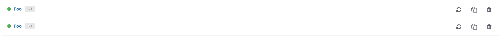
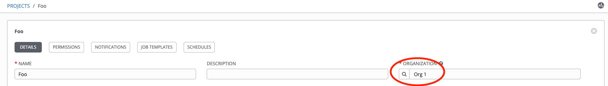
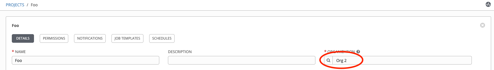

## Naming Conflicts

By now you should have seen that the modules use human-friendly names but the API uses internal IDs to track assets in Tower. The given names make it easier to read and understand what a playbook is doing. However, there will be times when a name is not unique. For example, projects can have the same name so long as they are in different organizations. In our bootstrap process we actually made two projects, both named “Foo”; one was created in “Org 1” and another in “Org 2”.

Verify this by going to the Projects page in the Web UI. There you should see two “Foo” projects:




Clicking on each of these we can see one exists in Org 1 while the other is in Org 2:







Now let’s see what happens when we try to use a Foo project in a playbook. Write a playbook to grant use permissions to the Foo project to our user, “snafu” (also created in the bootstrap process).

To do this we will use the `tower_role` module inside a playbook called `add_snafu_to_project.yml` with the following contents:

```
    ---
    - name: Add snafu to Foo project
      hosts: localhost
      connection: local
      gather_facts: False
      collections:
        - awx.awx

      tasks:
        - name: Add snafu to Foo project use RBAC
          tower_role:
            user: "snafu"
            role: "use"
            project: "Foo"
```

When you execute this playbook you are logging into the Ansible Tower server as the admin user who is a superuser and can see everything with the Ansible Tower instance, including both Foo projects:

```
[student1@ansible-1 ~]$ ansible-playbook add_snafu_to_project.yml

PLAY [Add snafu to Foo project] *****************************************************************************

TASK [Add snafu to Foo project use RBAC] *****************************************************************************
[WARNING]: You are using the awx version of this collection but connecting to Red Hat Ansible Tower
fatal: [localhost]: FAILED! => changed=false
  msg: Request to api/v2/projects/?name=Foo returned 2 items, expected 1
  query:
    name: Foo
  response:
    json:
      count: 2
      next: null
...

PLAY RECAP *****************************************************************************
localhost: ok=0 changed=0 unreachable=0 failed=1 skipped=0 rescued=0 ignored=0
```

Since an admin user can see both Foo projects, we get an error that the request returned 2 items but expected 1.

There are two ways to solve this problem. The first would be for our playbook to authenticate into Tower as a user who has a better scope. In our bootstrap process we also created an admin of “Org 1” named org1admin. This user is not a superuser so they would only see the Foo project which is tied to Org1. To validate this, log into the Web UI using:

**User**: `org1admin`

**Password**: `org1admin`

On the projects page you should only see a single Foo project. Because of this, if we have our playbook run as org1admin instead of admin, our playbook will work. Earlier we said we would talk about `tower_cli.cfg` files and now is a good time to do that. As previously stated, the collection supports the legacy tower-cli configuration files for backwards compatibility. Tower CLI would look for files in the following locations (let's assume we are running in the directory `/path/to/playbook`):

- `/path/to/playbook/tower_cli.cfg`
- `/path/to/tower_cli.cfg`
- `/path/tower_cli.cfg`
- `/tower_cli.cfg`
- `~/.tower_cli.cfg`
- `/etc/tower/tower_cli.cfg`

These are ordered in precedence (highest to lowest) and are additive, meaning that if `/etc/tower/tower_cli.cfg` contains a setting for host and `/path/to/playbook/tower_cli.cfg` also has a host directive, the host from `/path/to/playbook/tower_cli.cfg` will be used. In addition, these config files are additive, so if `/etc/tower/tower_cli.cfg` contains a setting for `verify_ssl` and no other config does, then that value will be used even if there are other config files that exist in the paths.

In addition to these default file locations, all modules support a setting to specify a config file called `tower_config_file`. If a file is specified in that setting it will override the default path loading order.

In order to get around our environment issue, we are going to create a file called `org1_tower_cli.cfg` in the current directory with the following values:

```
    [general]
    username = org1admin
    password = org1admin
```

Now that we have that in place let’s modify our existing `add_snafu_to_project.yml` file to add the loading of the file to our task:

```
        - name: Add snafu to Foo project use RBAC
          tower_role:
            user: "snafu"
            role: "use"
            project: "Foo"
            tower_config_file: "org1_tower_cli.cfg"
```

What would you expect to happen when we run this?

```
[student1@ansible-1 ~]$ ansible-playbook add_snafu_to_project.yml

PLAY [Add snafu to Foo project] *****************************************************************************

TASK [Add snafu to Foo project use RBAC] *****************************************************************************
[WARNING]: You are using the awx version of this collection but connecting to Red Hat Ansible Tower
fatal: [localhost]: FAILED! => changed=false
  msg: Request to api/v2/projects/?name=Foo returned 2 items, expected 1
  query:
    name: Foo
  response:
    json:
      count: 2
      next: null
...

PLAY RECAP *****************************************************************************
localhost: ok=0 changed=0 unreachable=0 failed=1 skipped=0 rescued=0 ignored=0
```

We end up with the same error we previously encountered. This is because the environment variables supersede any config files that are found. To prove this, let's unset our environment variables and run our playbook again. This time we should log into Ansible Tower as org1admin, who has a different scope in the RBAC (role-based access control) which makes the project name Foo unique again:

```
[student1@ansible-1 ~]$ unset TOWER_USERNAME
[student1@ansible-1 ~]$ unset TOWER_PASSWORD
[student1@ansible-1 ~]$ ansible-playbook add_snafu_to_project.yml
PLAY [Add snafu to Foo project] *****************************************************************************

TASK [Add snafu to Foo project use RBAC] *****************************************************************************
[WARNING]: The parameter(s) tower_host were provided at the same time as tower_config_file. Precedence may be unstable, we suggest either using config file or params.
[WARNING]: You are using the awx version of this collection but connecting to Red Hat Ansible Tower
changed: [localhost]

PLAY RECAP *****************************************************************************
localhost: ok=1 changed=1 unreachable=0 failed=0 skipped=0 rescued=0 ignored=0   
```

In addition to the play now working, note the additional warning that comes out. We still have the `TOWER_HOST` environment variable set so we get a warning that some direct parameters were set in addition to the `tower_config` file. The collection recommends that we use one or the other but not both. \

Let's set our environment variables back for the admin login:

```
[student1@ansible-1 ~]$ export TOWER_USERNAME=admin
[student1@ansible-1 ~]$ export TOWER_PASSWORD=[your password]
```

The approach of limiting your scope in the RBAC model might not always be possible. While you can use different authentication settings per task, that can become very tedious if you are dealing with a large number of scopes to switch through.

Another option is to use an ID instead of a name. The modules will accept IDs anywhere it will accept a name and an ID will match at a higher priority than a name. To help you find the IDs of assets, the AWX Collection comes with a lookup plugin called `tower_api`. While the plugin is a generic way to get information out of the API, it can also be used to return objects representing assets or even asset lists. In our use case, we will use a setting to force it to just return object IDs.

Let’s write a playbook called `lookup_ids.yml` with the following content:

```
    ---
    - name: Lookup the org id
      hosts: localhost
      connection: local
      gather_facts: False
      collections:
        - awx.awx

      tasks:
        - name: Get the ID of Org 2
          set_fact:
            org2id: "{{ lookup('awx.awx.tower_api', 'organizations', query_params={'name': 'Org 2'}, expect_one=True, return_ids=True) }}"

        - debug:
            msg: "Org 2 ID is {{ org2id }}"

        - name: Get the ID of the Foo project in Org 2
          set_fact:
            foo_id: "{{ lookup('awx.awx.tower_api', 'projects', query_params={'name': 'Foo', 'organization': org2id} , expect_one=True, return_ids=True) }}"

        - debug:
            msg: "ID is {{ foo_id }}"
```

This playbook starts by looking up the ID for Org 2 and then uses that ID to look up a project named Foo tied to the organization to the ID we found for Org 2. When we run this, we get the following output:

```
[student1@ansible-1 ~]$ ansible-playbook lookup_ids.yml
PLAY [Lookup the org id] *****************************************************************************

TASK [Get the ID or Org 2] *****************************************************************************
[WARNING]: You are using the awx version of this collection but connecting to Red Hat Ansible Tower
ok: [localhost]

TASK [debug] *****************************************************************************
ok: [localhost] => {
    "msg": "Org 2 ID is 23"
}

TASK [Get the ID of the Foo project in Org 2] *****************************************************************************
[WARNING]: You are using the awx version of this collection but connecting to Red Hat Ansible Tower
ok: [localhost]

TASK [debug] *****************************************************************************
ok: [localhost] => {
    "msg": "ID is 125"
}

PLAY RECAP *****************************************************************************
localhost: ok=4 changed=0 unreachable=0 failed=0 skipped=0 rescued=0 ignored=0   
```

> **Note**: Your IDs will be different than the ones above.

To validate that we found the correct IDs, log into the Web UI and go to Organizations and then click on Org 2. Once the Org 2 screen has loaded, your URL should look like:

```
https://10.0.1.73/#/organizations/23?organization_search=page_size:20;order_by:name
```

Note that the ID is in the Web UI URL (**bolded** in the example above); this is true for all assets. You can also verify that we found the correct project ID using the same method. Load the project in the Web UI and validate that the ID in the URL matches the found ID.

Finally, we can circle back and update our `add_snafu_to_project.yml` file to reference the ID of the Foo project by ID instead of by name:

```
    ---
    - name: Add snafu to Foo project
      hosts: localhost
      connection: local
      gather_facts: False
      collections:
        - awx.awx

      tasks:
        - name: Get the ID of Org 2
          set_fact:
            org2id: "{{ lookup('awx.awx.tower_api', 'organizations', query_params={'name': 'Org 2'}, expect_one=True, return_ids=True) }}"

        - name: Add snafu to Foo project use RBAC
          tower_role:
            user: "snafu"
            role: "use"
            project: "{{ lookup('awx.awx.tower_api', 'projects', query_params={'name': 'Foo', 'organization': org2id} , expect_one=True, return_ids=True) }}"
```

The results will be:

```
[student1@ansible-1 ~]$ ansible-playbook add_snafu_to_project.yml
PLAY [Add snafu to Foo project] *****************************************************************************

TASK [Get the ID or Org 2] *****************************************************************************
[WARNING]: You are using the awx version of this collection but connecting to Red Hat Ansible Tower
ok: [localhost]

TASK [Add snafu to Foo project use RBAC] *****************************************************************************
[WARNING]: You are using the awx version of this collection but connecting to Red Hat Ansible Tower
[WARNING]: You are using the awx version of this collection but connecting to Red Hat Ansible Tower
changed: [localhost]

PLAY RECAP *****************************************************************************
localhost: ok=2 changed=1 unreachable=0 failed=0 skipped=0 rescued=0 ignored=0   
```

We have now successfully added the user to the correct project (via IDs) even though our admin user can see both “Foo” projects.
