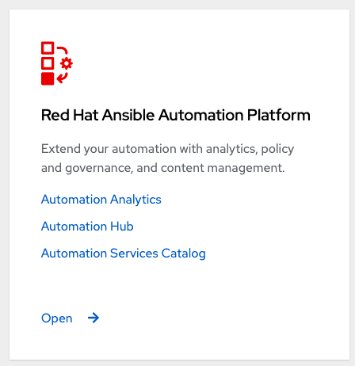
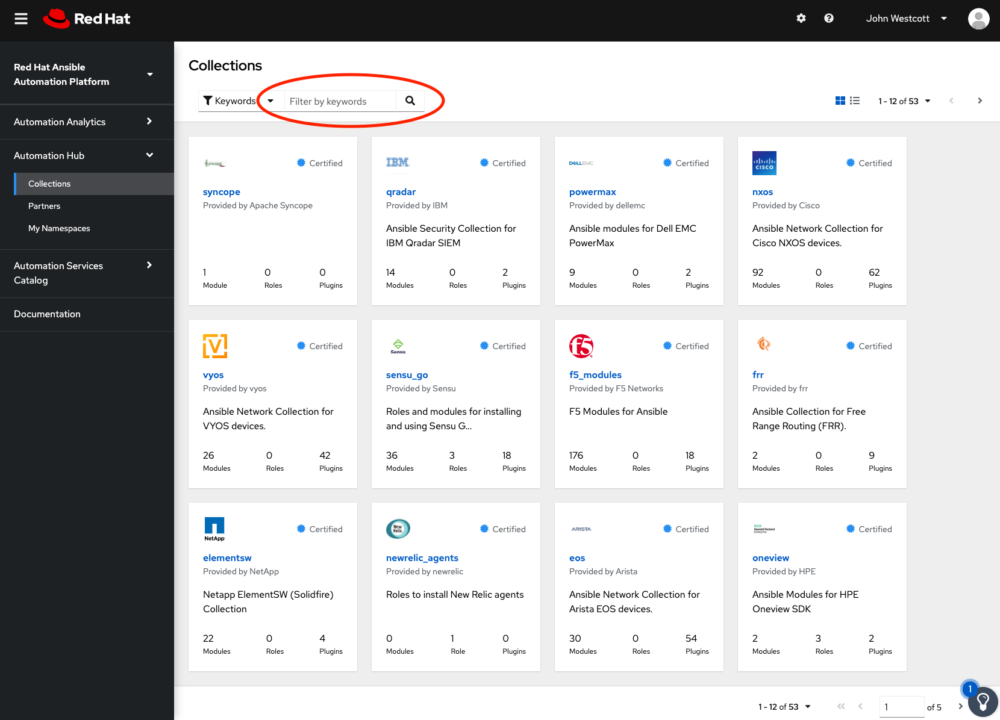
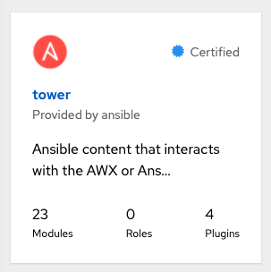
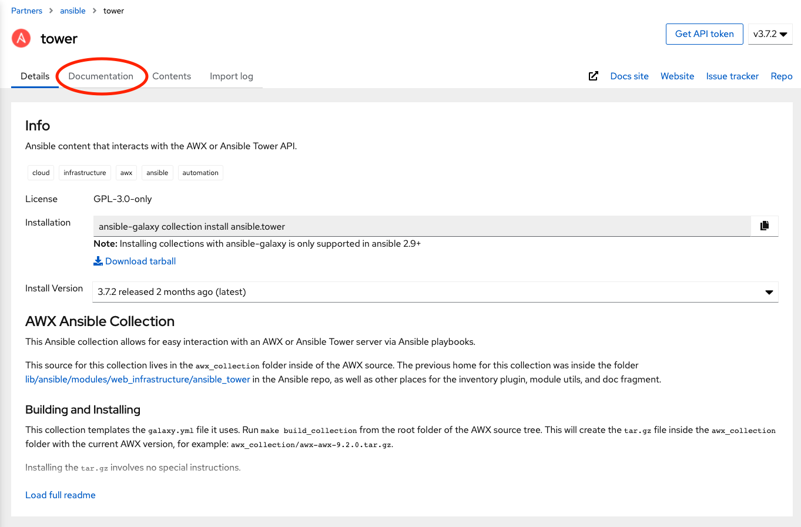
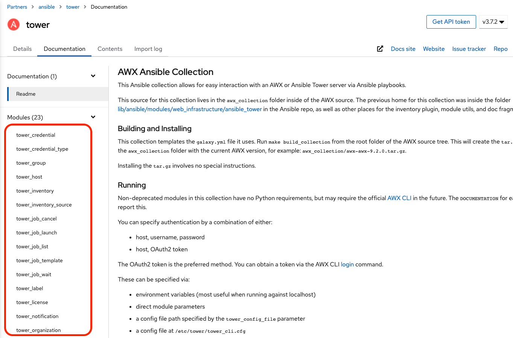
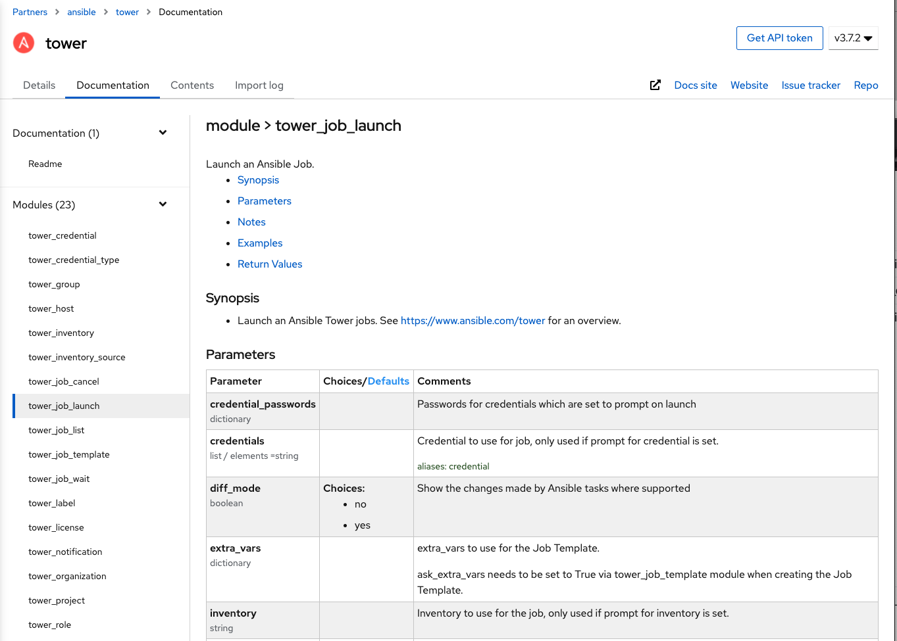
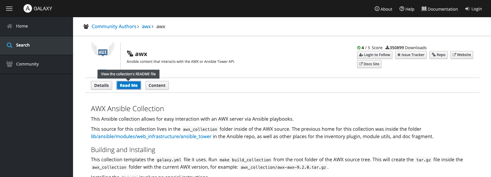
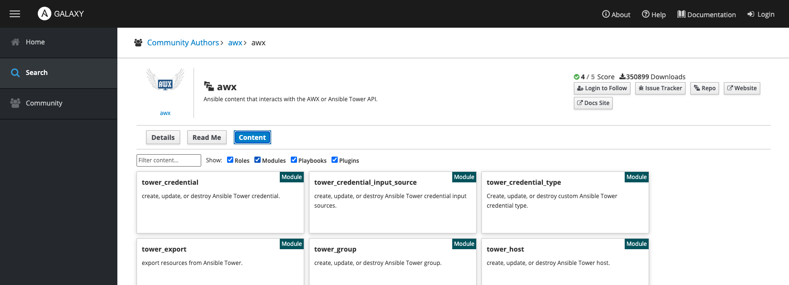
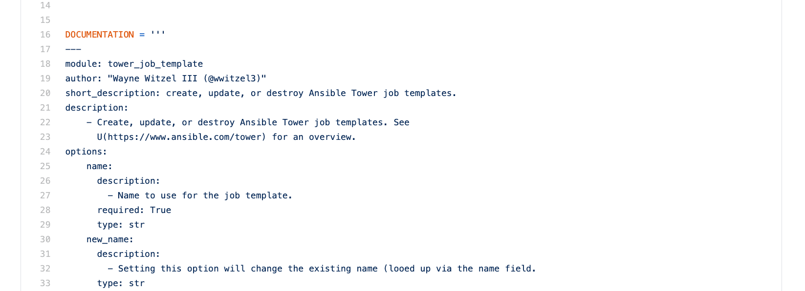

## Collection Documentation

Content Hub is the best way to see the documentation of the `ansible.tower` collection. To get into the Content Hub, go to [https://cloud.redhat.com](https://cloud.redhat.com) and log in with your Red Hat credentials.

> **Note:** If you don’t have credentials, feel free to just follow along. There is nothing in this section required for other sections.

On the landing screen look for the “Red Hat Ansible Automation Platform” tile:




On this tile, select Automation Hub to go straight to the collections page where you can search through all of the supported, certified collections. To find the `ansible.tower` collection we will simply type “tower” into the search bar and press enter (or click the search icon):




This will show you the tile for the `ansible.tower` collection:




Clicking on the tile will bring you to the details page of the collection. On the top of the page, select the Documentation tab:




This will show you the `README.md` contents of the collection and in the left hand menu we can select a specific module within the collection to get detailed information about that module:




Here I have selected information about the `tower_job_launch` module:




Notice the links where you can jump to:

- Synopsis
- Parameters
- Notes
- Examples
- Return Values

Individual modules will vary depending on what their documentation declares.

For the `awx.awx` collection, as we saw previously, Ansible Galaxy will render the `README.md` file ([https://galaxy.ansible.com/awx/awx](https://galaxy.ansible.com/awx/awx)):




And will show you the available modules within the collection:




But rendered information about the individual modules is not currently available. The best way to get their documentation is with the `ansible-doc` command. For example, you can run the command:

```
[student1@ansible-1 ~]$ ansible-doc awx.awx.tower_job_template
> TOWER_JOB_TEMPLATE    (/Users/jowestco/.ansible/collections/ansible_collections/awx/awx/plugins/modules/tower_job_template.py)

        Create, update, or destroy Ansible Tower job templates. See https://www.ansible.com/tower for an overview.

  * This module is maintained by The Ansible Community
OPTIONS (= is mandatory):

- allow_simultaneous
        Allow simultaneous runs of the job template.
        (Aliases: concurrent_jobs_enabled)[Default: no]
        type: bool

- ask_credential_on_launch
        Prompt user for credential on launch.
        (Aliases: ask_credential)[Default: False]
        type: bool
...
```

The documentation for all sources come directly from the module’s `DOCUMENTATION` variable so reading the source code is another way to get the modules documentation. For example, the `tower_job_template` documentation can be seen starting around line 16 in its code ([https://github.com/ansible/awx/blob/devel/awx_collection/plugins/modules/tower_job_template.py](https://github.com/ansible/awx/blob/devel/awx_collection/plugins/modules/tower_job_template.py)):


