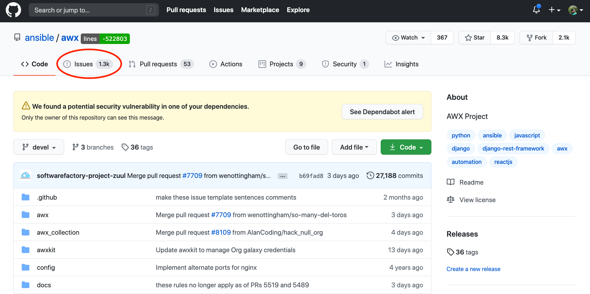
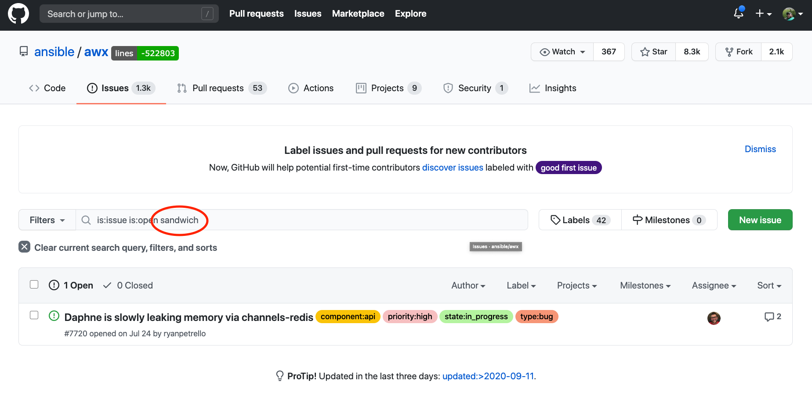
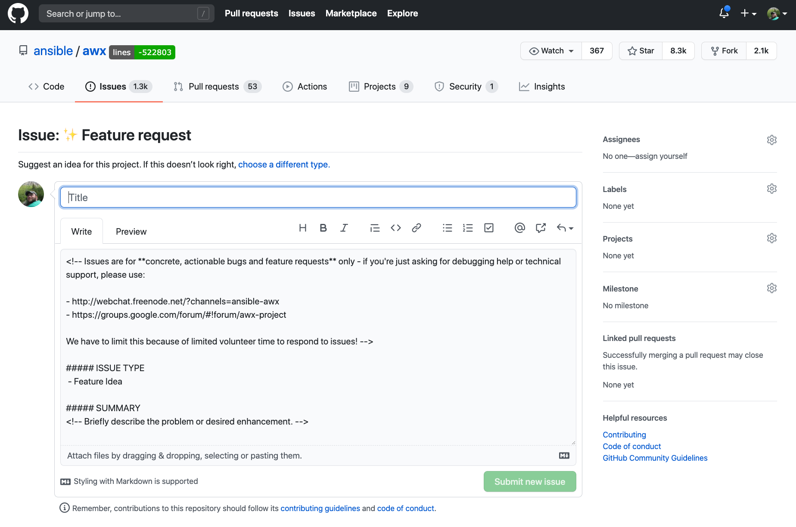

## Getting Help

If you find an issue with the Collections, we want to know! There are two paths to get help depending on which Collection you are using.

For `ansible.tower`, this collection is fully supported. To report an issue you can log into [https://access.redhat.com](https://access.redhat.com) and open a support case.

For `awx.awx`, this collection is community supported. Issues related to this collection can be opened in the GitHub repo for AWX itself. To report an issue, go to [https://github.com/ansible/awx](https://github.com/ansible/awx) and then click on the Issues tab:

On this issues page, use the search bar to see if anyone else has reported a similar or identical issue already. Let’s say our issue is that collection cannot make me a sandwich. I’ll start with a generic term like sandwich and search on that:

We can see that there is one issue matched but clearly not our problem. So we click on the green “New Issue” button. On the next screen we are given the choice of what kind of issue to create:

Click the “get started” button next to the type of issue you would like to open, this will take you to a web form. In our case, since we want the collection to make us a sandwich, we will choose Feature Request:

We give our feature a title and fill out the information as instructed in the body and then click the “Submit New Issue” button.

This will create a new issue which will be reviewed by the AWX community. Since you opened the issue, you should get email notifications throughout the lifecycle of the issue.
