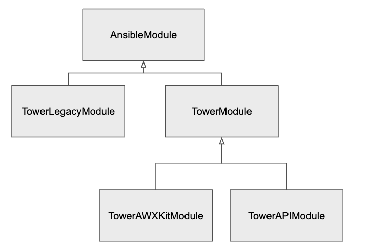

## Collection Layout

For now we are going to continue looking in the `awx_collection` directory which is the parent folder of the collection.

```
[student1@ansible-1 awx]$ cd awx_collection
[student1@ansible-1 awx_collection]$ ls
COPYING		galaxy.yml		plugins
setup.cfg		tests			README.md
meta			requirements.txt	test
tools
```

This directory is the root folder of the collection and, if you are familiar with collections, will have a similar structure to collections themselves.

The `COPYING` file contains license information for the collection (which is licensed under GPLv3):

```
[student1@ansible-1 awx_collection] head -10 COPYING
GNU GENERAL PUBLIC LICENSE
   Version 3, 29 June 2007

Copyright (C) 2007 Free Software Foundation, Inc. <http://fsf.org/>
Everyone is permitted to copy and distribute verbatim copies
of this license document, but changing it is not allowed.

        Preamble

The GNU General Public License is a free, copyleft license for
```

The `galaxy.yml` file is a standard file used by Ansible Galaxy to identify and provide information about the collection. View this file and see what information is in there. The `setup.cfg` file contains some defaults we use when running tests against the plugin. The `requirements.txt` file tells you what, if any, additional libraries are required to run the collection. Let’s look deeper at this file:

```
[student1@ansible-1 awx_collection] more requirements.txt
pytz  # for tower_schedule_rrule lookup plugin
python-dateutil>=2.7.0  # tower_schedule_rrule
awxkit  # For import and export modules
```

Based on this, we can see that the bulk of the collection does not require any additional libraries to be installed. However, there are a couple of features for which requirements are needed. Specifically, the `tower_schedule_rrule` requires the libraries `pytz` and `python-dateutil` to be added to the virtual environment in order to run. Additionally, the `awxkit` library is required for the import and export modules to function.

> **Note:** the `tower-cli` library is required to use the legacy send/receive modules. These modules have been deprecated in favor of the import/export modules, so this dependency is not listed in the `requirements.txt` file.

Finally, the `README.md` file is what is displayed as the collections information file in:

- Ansible Galaxy
- Red Hat Automation Hub
- GitHub collection landing page

If you look at the file in this directory, note the following message:

```
[student1@ansible-1 awx_collection] head -15 README.md
# AWX Ansible Collection

[comment]: # (*******************************************************)
[comment]: # (*                                                     *)
[comment]: # (*             WARNING                                 *)
[comment]: # (*                                                     *)
[comment]: # (*  This file is templated and not to be               *)
[comment]: # (*  edited directly! Instead modify:                   *)
[comment]: # (*  tools/roles/template_galaxy/templates/README.md.j2 *)
[comment]: # (*                                                     *)
[comment]: # (*  Changes to the base README.md file are refreshed   *)
[comment]: # (*  upon build of the collection                       *)
[comment]: # (*******************************************************)
```

This file is managed by an Ansible template which dynamically generates the content for both the `awx.awx` collection and the `ansible.tower` collection. What you are seeing here is a rendered placeholder of that template.

Next, let’s start looking at our directories, which include:

- `meta`
- `test`
- `tests`
- `plugins`
- `tools`

The `meta` directory is a standard Ansible collection directory and contains a `runtime.yml` file which houses routing information. If you look at this file you will see deprecation messages for `tower_receive`, `tower_send` and `tower_workflow_template`. In addition you will see that `tower_notification` is a redirect for the module `tower_notification_template`. For consistency, the modules are closely named to their endpoints (which we will discuss later). In `ansible_core`, there was a module called `tower_notification` but this was really managing the notification templates endpoint. In the new collection we have renamed this module `tower_notification_template` and told Ansible that any calls to the legacy module `tower_notification` should be redirected to the new proper module name.

The `/test` and `/tests` directories contain unit and integration tests, respectively. In the collection we strive to have test coverage for all modules.


### Unit Tests

The unit tests are stored in the `test/awx` directory and, where possible, test interactions between the modules and the AWX database. These tests will be familiar to Python developers. This is achieved by using a Python testing suite and having a mocked layer which emulates interactions with the Tower API. You do not need a server to run these unit tests. The depth of testing is not fixed and can change from module to module. Let’s take a quick look at the `test_token.py` file (which tests the `tower_token` module):

```
from __future__ import (absolute_import, division, print_function)
__metaclass__ = type

import pytest

from awx.main.models import OAuth2AccessToken

@pytest.mark.django_db
def test_create_token(run_module, admin_user):

    module_args = {
        'description': 'barfoo',
        'state': 'present',
        'scope': 'read',
        'tower_host': None,
        'tower_username': None,
        'tower_password': None,
        'validate_certs': None,
        'tower_oauthtoken': None,
        'tower_config_file': None,
    }

    result = run_module('tower_token', module_args, admin_user)
    assert result.get('changed'), result

    tokens = OAuth2AccessToken.objects.filter(description='barfoo')
    assert len(tokens) == 1, 'Tokens with description of barfoo != 0: {0}'.format(len(tokens))
    assert tokens[0].scope == 'read', 'Token was not given read access'
```

This test has a single test called `test_create_token`. It creates a `module_args` section which is what will be passed into our module. We then call `run_module` asking it to run the `tower_token` module with the `module_args` we created and give us back the results. After that we run an assertion to validate that our module did in fact report a change to the system. We will then use Python objects to look up the token that has a description of `barfoo` (which was in our arguments to the module). We want to validate that we only got back one token (the one we created) and that the scope of the token we created was read.


### Integration Tests

Integration tests are stored in the `/tests` directory and will be familiar to Ansible developers as these tests are executed with the `ansible-test` command line program.

Inside the `/tests` directory there are two folders:

- `/integration`
- `/sanity`

In the `sanity` folder are files directives for specific Ansible versions which contain information about which tests to skip for specific files. There are a number of reasons you may need to skip a sanity test. See the <code>[ansible-test documentation](https://docs.ansible.com/ansible/latest/dev_guide/testing_running_locally.html)</code> for more details about how and why you might want to skip a test.

In the `integration/targets` folder you will see directories (which act as roles) for all of the different modules and plugins. When the collection is tested an instance of Ansible Tower (or AWX) will be spun up and these roles will be applied to the target server to validate the functionality of the modules. Since these are really roles, each directory will contain a tasks folder under it with a `main.yml` file as an entry point. While not strictly followed, the general flow of a test should be:

- _Generate a Test ID_

  `- name: Generate test id`

    ```
      set_fact:
        test_id: "{{ lookup('password', '/dev/null chars=ascii_letters length=16') }}"
    ```


- _Generate Names for Any Objects This Test Will Create_

  `- name: Generate names`

    ```
      set_fact:
        group_name1: "AWX-Collection-tests-tower_instance_group-group1-{{ test_id }}"
        group_name2: "AWX-Collection-tests-tower_instance_group-group2-{{ test_id }}"
        cred_name1: "AWX-Collection-tests-tower_instance_group-cred1-{{ test_id }}"
    ```


- _Non-creating tests (i.e. test for specific error conditions, etc), with assertion_

  `- name: Try to use a token as a dict which is missing the token parameter`

    ```
      tower_job_list:
        tower_oauthtoken:
          not_token: "This has no token entry"
      register: results
      ignore_errors: true

    - assert:
        that:
          - results is failed
          - '"The provided dict in tower_oauthtoken did not properly contain the token entry" == results.msg'
    ```


- _Block:_
    - Run test which creates/modifies/deletes object(s)

    `- name: Create a container group`

        ```
              tower_instance_group:
                name: "{{ group_name2 }}"
                credential: "{{ cred_result.id }}"
              register: result
        ```

    - Assert proper results were returned

      ```
              - assert:
                  that:
                    - "result is changed"
      ```


- _Always:_
    - Cleanup created objects \

    `- name: Delete the credential`

        ```
              tower_credential:
                name: "{{ cred_name1 }}"
                organization: "Default"
                credential_type: "OpenShift or Kubernetes API Bearer Token"
        ```

    - Assert cleanup worked properly (if needed)

When writing an integration test, a test of asset type A does not need to make assertions for asset type B. For example, if you are writing an integration test for a credential and you create a custom credential type, you do not need to assert that the `tower_credential_type` call properly worked, you can assume it will. In addition, when cleaning up and deleting the `tower_credential_type`, you do not need to assert that it properly deleted the credential type.

Tests are very important to make sure changes to the collection function properly and do not adversely affect expected behavior. When an issue is reported, it is best to replicate its behavior within a test with an assertion for the desired behavior. After that, work on fixing the code and running the test to ensure your change corrected the problem and did not affect anything else.


### Running Tests

To run unit tests we can use the Makefile. In addition to the make command, you need a virtual environment with several requirements installed. These requirements are outlined in the `awx_collection/README.md` file. The process for the installation will differ depending on OS and version; here are the commands for the lab environment we are working in:

```
[student1@ansible-1 awx] $ sudo yum install -y --enablerepo \* libtool-ltdl postgresql-devel openldap-devel pkg-config xmlsec1-devel libtool-ltdl-devel


[student1@ansible-1 awx]$ virtualenv ~/virtuelenvs/awx
created virtual environment CPython3.6.8.final.0-64 in 260ms
  creator CPython3Posix(dest=/home/student1/virtuelenvs/awx, clear=False, global=False)
  seeder FromAppData(download=False, pip=bundle, setuptools=bundle, wheel=bundle, via=copy, app_data_dir=/home/student1/.local/share/virtualenv)
    added seed packages: PyJWT==1.7.1, pip==20.2.2, python_dateutil==2.8.1, setuptools==49.6.0, six==1.14.0, wheel==0.35.1
  activators BashActivator,CShellActivator,FishActivator,PowerShellActivator,PythonActivator,XonshActivator
[student1@ansible-1 awx]$ source ~/virtuelenvs/awx/bin/activate
(awx) [student1@ansible-1 awx]$ pip install ansible
Collecting ansible
  Downloading ansible-2.10.0.tar.gz (25.5 MB)
...
Successfully installed MarkupSafe-1.1.1 PyYAML-5.3.1 ansible-2.10.0 ansible-base-2.10.1 cffi-1.14.3 cryptography-3.1.1 jinja2-2.11.2 packaging-20.4 pyparsing-2.4.7
(awx) [student1@ansible-1 awx]$ pip install -r requirements/requirements.txt
Collecting adal==1.2.2
...
Successfully installed adal-1.2.2...
(awx) [student1@ansible-1 awx]$ pip install -r requirements/requirements_dev.txt
Collecting django-debug-toolbar==1.11
...
Successfully installed Send2Trash-1.5.0...
(awx) [student1@ansible-1 awx]$ pip install -e .
Obtaining file:///home/student1/awx
Installing collected packages: awx
  Running setup.py develop for awx
Successfully installed awx
(awx) [student1@ansible-1 awx]$ pip install -e awxkit
Obtaining file:///home/student1/awx/awxkit
Requirement already satisfied: PyYAML in /home/student1/virtuelenvs/awx/lib64/python3.6/site-packages (from awxkit==14.1.0) (5.3.1)
Requirement already satisfied: requests in /home/student1/virtuelenvs/awx/lib/python3.6/site-packages (from awxkit==14.1.0) (2.23.0)
Requirement already satisfied: idna<3,>=2.5 in /home/student1/virtuelenvs/awx/lib/python3.6/site-packages (from requests->awxkit==14.1.0) (2.9)
Requirement already satisfied: urllib3!=1.25.0,!=1.25.1,<1.26,>=1.21.1 in /home/student1/virtuelenvs/awx/lib/python3.6/site-packages (from requests->awxkit==14.1.0) (1.25.8)
Requirement already satisfied: chardet<4,>=3.0.2 in /home/student1/virtuelenvs/awx/lib/python3.6/site-packages (from requests->awxkit==14.1.0) (3.0.4)
Requirement already satisfied: certifi>=2017.4.17 in /home/student1/virtuelenvs/awx/lib/python3.6/site-packages (from requests->awxkit==14.1.0) (2020.6.20)
Installing collected packages: awxkit
  Running setup.py develop for awxkit
Successfully installed awxkit
(awx) [student1@ansible-1 awx]$ export VENV_BASE=~/virtuelenvs/
```

At this point, we should now be ready to execute the collection tests. However, we are running on a machine that already has Ansible Tower installed. Because of this, the tests will attempt to use the actual Ansible Tower database rather than its own internal database which will cause issues. To get around this we are going to temporarily move the `/etc/tower` directory:

```
(awx) [student1@ansible-1 awx]$ sudo mv /etc/tower /etc/tower.tmp
```
Once your environment is completely established you can run all of the unit tests with the command (your results may vary):

```
(awx) [student1@ansible-1 awx]$ make test_collection
rm -f /home/student1/virtuelenvs//awx/lib/python3.6/no-global-site-packages.txt
if [ "/home/student1/virtuelenvs/" ]; then \
        . /home/student1/virtuelenvs//awx/bin/activate; \
fi; \
py.test awx_collection/test/awx -v
==================================== test session starts ====================================
platform linux -- Python 3.6.8, pytest-6.1.0, py-1.9.0, pluggy-0.13.1 -- /home/student1/virtuelenvs/awx/bin/python
cachedir: .pytest_cache
django: settings: awx.settings.development (from ini)
rootdir: /home/student1/awx, configfile: pytest.ini
plugins: cov-2.10.1, django-3.10.0, pythonpath-0.7.3, mock-1.11.1, timeout-1.4.2, forked-1.3.0, xdist-1.34.0
collected 116 items

awx_collection/test/awx/test_application.py::test_create_application PASSED                [  0%]
awx_collection/test/awx/test_completeness.py::test_completeness PASSED                     [  1%]

...

==================================== short test summary info ====================================
FAILED awx_collection/test/awx/test_job_template.py::test_create_job_template - AssertionError: assert {'changed': T...'name': 'foo'} == {'changed': T...
FAILED awx_collection/test/awx/test_job_template.py::test_job_template_with_new_credentials - assert 16 == 14
FAILED awx_collection/test/awx/test_job_template.py::test_job_template_with_survey_spec - assert 11 == 9
FAILED awx_collection/test/awx/test_module_utils.py::test_version_warning - SystemExit: 1
FAILED awx_collection/test/awx/test_module_utils.py::test_type_warning - SystemExit: 1
====================== 5 failed, 106 passed, 5 skipped, 56 warnings in 48.53s ===================
make: *** [Makefile:382: test_collection] Error 1
```

In addition to running all of the tests, you can also specify specific tests to run. This is useful when developing a single module. In this example, I am running the tests for the `tower_token` module:

```
(awx) [student1@ansible-1 awx] pytest awx_collection/test/awx/test_token.py
============================ test session starts ============================
platform darwin -- Python 3.7.0, pytest-3.6.0, py-1.8.1, pluggy-0.6.0
django: settings: awx.settings.development (from ini)
rootdir: /Users/jowestco/junk/awx, inifile: pytest.ini
plugins: xdist-1.27.0, timeout-1.3.4, pythonpath-0.7.3, mock-1.11.1, forked-1.1.3, django-3.9.0, cov-2.8.1
collected 1 item                                                                                                                                                  

awx_collection/test/awx/test_token.py .                               [100%]

========================= 1 passed in 1.72 seconds =========================
```

Before we proceed to integration testing, let's put our `/etc/tower` directory back with the command:

```
(awx) [student1@ansible-1 awx]$ sudo mv /etc/tower.tmp /etc/tower
```

For integration tests we need an existing AWX or Ansible Tower instance to run our tests against. We can write a simple `run_it.yml` playbook to invoke the main method:

```
    ---
    - name: Run Integration Test
      hosts: localhost
      connection: local
      gather_facts: False
      environment:
          TOWER_HOST: <tower URL>
          TOWER_USERNAME: admin
          TOWER_PASSWORD: <tower password>
          TOWER_VERIFY_SSL: False
      collections:
        - awx.awx

      tasks:
        - include_tasks: main.yml
```

This playbook will set up our connection parameters via environment variables and then invoke the `main.yml` play of the role. Try running an integration test like this now. First go to the `awx_collection/tests/integration/targets` in the `awx` directory and do an `ls` to see all of the integration test roles. Many of the integration tests use some predefined data which can be created by running the `demo_data` role. Go into `demo_data/tasks` and create a `run_it.yml` file here with the content above and then run the playbook:

```
(awx) [student1@ansible-1 tasks]$ ansible-playbook run_it.yml

PLAY [Run Integration Test] **************************************************************************************
TASK [include_tasks] **************************************************************************************
included: /home/student1/awx/awx_collection/tests/integration/targets/demo_data/tasks/main.yml for localhost

TASK [Assure that default organization exists] **************************************************************************************
[WARNING]: You are using the awx version of this collection but connecting to Red Hat Ansible Tower
ok: [localhost]

TASK [HACK - delete orphaned projects from preload data where organization deleted] **********************************************************************

TASK [Assure that demo project exists] **************************************************************************************
changed: [localhost]

TASK [Assure that demo inventory exists] **************************************************************************************
changed: [localhost]

TASK [Create a Host] **************************************************************************************
changed: [localhost]

TASK [Assure that demo job template exists] **************************************************************************************
changed: [localhost]

PLAY RECAP **************************************************************************************
localhost: ok=6    changed=4    unreachable=0    failed=0    skipped=1    rescued=0    ignored=0   
```

Now let’s run the `tower_team` tests to see if they work. Go to `../../tower_team/tasks` and create the `run_it.yml` file with the above contents (or copy the one from the `demo_data` directory) and run it:

```
(awx) [student1@ansible-1 tasks]$ ansible-playbook run_it.yml

PLAY [Run Integration Test] **************************************************************************************

TASK [include_tasks] **************************************************************************************
included: /home/student1/awx/awx_collection/tests/integration/targets/tower_team/tasks/main.yml for localhost

TASK [Generate names] **************************************************************************************ok: [localhost]

TASK [Attempt to add a Tower team to a non-existant Organization] **************************************************************************************
[WARNING]: You are using the awx version of this collection but connecting to Red Hat Ansible Tower
fatal: [localhost]: FAILED! => changed=false
  msg: Request to /api/v2/organizations/?name=Missing_Organization returned 0 items, expected 1
  query:
    name: Missing_Organization
  response:
    json:
      count: 0
      next: null
      previous: null
      results: []
    status_code: 200
  total_results: 0
...ignoring

TASK [Assert a meaningful error was provided for the failed Tower team creation] ************************************************************************
ok: [localhost] => changed=false
  msg: All assertions passed

TASK [Create a Tower team] **************************************************************************************changed: [localhost]

TASK [assert] **************************************************************************************ok: [localhost] => changed=false
  msg: All assertions passed

TASK [Delete a Tower team] **************************************************************************************changed: [localhost]

TASK [assert] **************************************************************************************ok: [localhost] => changed=false
  msg: All assertions passed

TASK [Check module fails with correct msg] **************************************************************************************fatal: [localhost]: FAILED! => changed=false
  msg: Request to /api/v2/organizations/?name=Non_Existing_Org returned 0 items, expected 1
  query:
    name: Non_Existing_Org
  response:
    json:
      count: 0
      next: null
      previous: null
      results: []
    status_code: 200
  total_results: 0
...ignoring

TASK [Lookup of the related organization should cause a failure] **************************************************************************************ok: [localhost] => changed=false
  msg: All assertions passed

PLAY RECAP **************************************************************************************localhost                  : ok=10   changed=2    unreachable=0    failed=0    skipped=0    rescued=0    ignored=2
```

You should see the tasks from the integration test run as expected.

> **Note**: It is critical to keep in mind that the integration tests run against the installed version of the collection, not against the files in `~/awx/awx_collection/plugins/modules`. Because of this, you need to build your development version of the collection prior to running a test against it or your results may vary. In order to avoid having to build everytime you can attempt to run “`make symlink_collection`”. This will attempt to symlink your development directory into the ansible installed collection location. However, please note collections and symlinks can be unstable. See the later section for how to install the development version of the collection.


### Plugins

The `plugins` directory contains all of the modules, lookup plugins, documentation fragments and other pieces that make up the collection.

The files in the `doc_fragments` folder are used to extend the documentation in the plugins and modules for common values. For new modules the file `doc_fragements/auth.py` is included. In here you will see entries for:

- `tower_host`
- `tower_username`
- `tower_password`
- `tower_oauthtoken`
- `validate_certs`
- `tower_config_file`

Plugins use shorter names because of their syntax so they have their own fragment called `auth_plugin.py` and legacy modules use `auth_legacy.py` in the `doc_fragements` folder.

The collection provides the inventory plugin used by Ansible Tower; this is located in the file `inventory/tower.py`. The collection also provides to lookup plugins, one of which we used in the lab above. The `tower_api.py` and `tower_schedule_rrule.py` files in the lookup directory are the plugins provided by the collection. The `tower_api` plugin we used in the lab and can be used as a general get utility for tower URLs. The `tower_schedule_rrule` file can be used for generating rrule strings when creating schedules within Tower.

The `module_utils` directory contains the definition of Python classes that are used by the modules. The general hierarchy of these classes is:




All modules in Ansible are subclasses of `AnsibleModule` itself. In the collection modules we provide implement one of three classes:

- `TowerLegacyModule` - This services `tower_send`, `tower_receive`, etc. Modules which come directly from the old ansible core and require tower-cli to run.
- `TowerAWXKitModule` - This services `tower_import` and `tower_export` and require awxkit to run.
- `TowerAPIModule` - This services all “new” modules and interacts with the Tower API directly requiring no other dependencies.

Note that `TowerAWXKitModule` and `TowerAPIModule` are subclasses of `TowerModule`. `TowerModule` provides the processing of the legacy `tower_cli.cfg` configuration files and deals with the auth parameters in a common way between the `AWXKIT` and API modules. This hierarchy helps contain consistencies between the modules even though they use different back ends to talk with Ansible Tower.

Since the bulk of the modules use `TowerAPIModule`, we will focus on those. The `TowerAPIModule` provides many methods for interacting with Tower as well as helper methods for fetching asset lists, resolving object names to IDs, looking up objects, etc. We will see some of these methods when we look at the modules themselves.

To start looking at the modules, let’s run these commands to get into the correct directory:

```
cd  ~/awx/awx_collection/plugins/modules
ls
```

In this directory you will see all of the `tower_*` modules available through the collection. These are standard ansible modules whose details are beyond the scope of this lab.

As mentioned before, these modules will use one of the three back ends we just talked about: `TowerLegacyModule`, `TowerAWXKitModule` and `TowerAPIModule`. To see which modules use which back ends you can run the command:

```
grep "module = " *
```

You will get results like:

```
tower_import.py:  module = TowerAWXKitModule(argument_spec=argument_spec, ...
tower_role.py:    module = TowerAPIModule(argument_spec=argument_spec)
tower_send.py:    module = TowerLegacyModule(argument_spec=argument_spec,...
```

Again, we will be focusing on talking about modules which leverage the `TowerAPIModule` back end. Of these modules there are two general patterns:

- CRUD (Create, Read, Update, Delete) modules - These interact with API endpoints to manage items in Tower (job templates, credentials, inventories, etc).
- Interaction modules - These interact with the API endpoint to perform a function on objects (launch tower job templates, wait for running jobs, update projects, etc).

Again, to narrow the scope of this document, we will be looking at the CRUD modules. The general outline of this module type is:

- Create argument spec specific to the module (connection params are not included)
- Create a TowerAPIModule (if this module does not use tower-cli or awxkit)
- Extract the parameters
- Resolve the IDs of any parameters what will be used to find the object (i.e., for a job template we need to lookup the organization field if supplied)
- Find the existing object by calling the `get_one` method
- If the state is absent, delete it
- Create a dict of all the new values which need to be set, lookup fields that are references to other assets (i.e. a job template is related to credentials, so resolve their names to IDs)
- Create associations if needed (i.e. a job template is associated to labels)
- Call the `module.create_or_update_if_needed` supplying all information

Some modules have additional tasks that need to happen if an object is created or changed. The `create_or_update_if_needed` method has ways to call functions on those conditions.

Let’s look at one of the simplest modules, `tower_team`. A team is one of the highest levels of objects within Ansible Tower which only depends on an organization. Look at this file and see if you can identify the code lines which correspond to the outline above.


### Tools

Finally, the `tools` directory! This directory contains some useful Ansible tools used to build and manage the collection. The two top level playbooks are `generate.yml` and `template_galaxy.yml`. The `template_galaxy.yml` file is responsible for templating out the `README.md` file (which we discussed before) as well as the `galaxy.yml`. This gets run as part of the build and publishing process of the collections.

The `generate.yml` file can be used to make new modules from the API. The idea behind that playbook is to load an API endpoint and its options page and generate CRUD modules on the fly. Since the modules are in a standardized format we can use a jinja2 template and the data loaded from the API to create a module. While the template does not work perfectly yet when building a new module, this can be a good place to start. The auto-generation process is beyond the scope of this lab.
