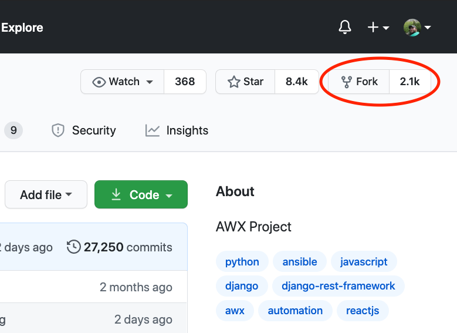
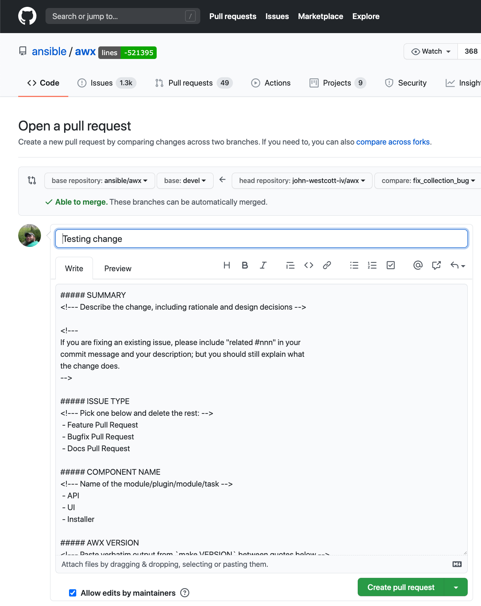
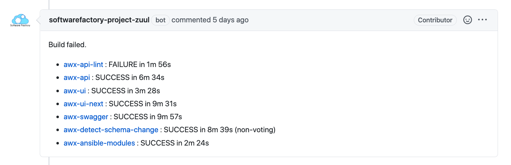
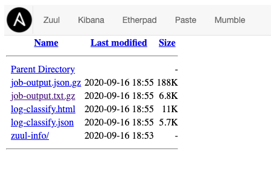
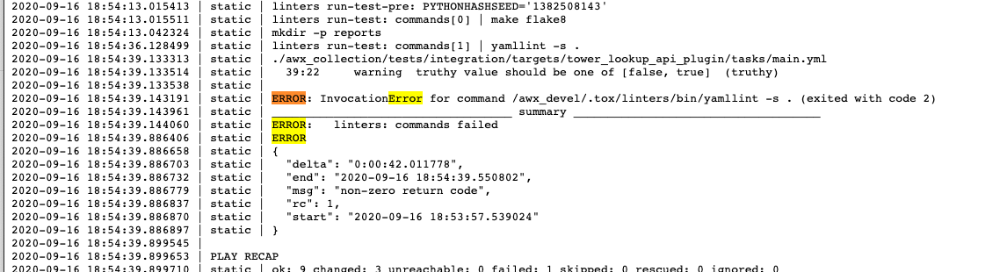
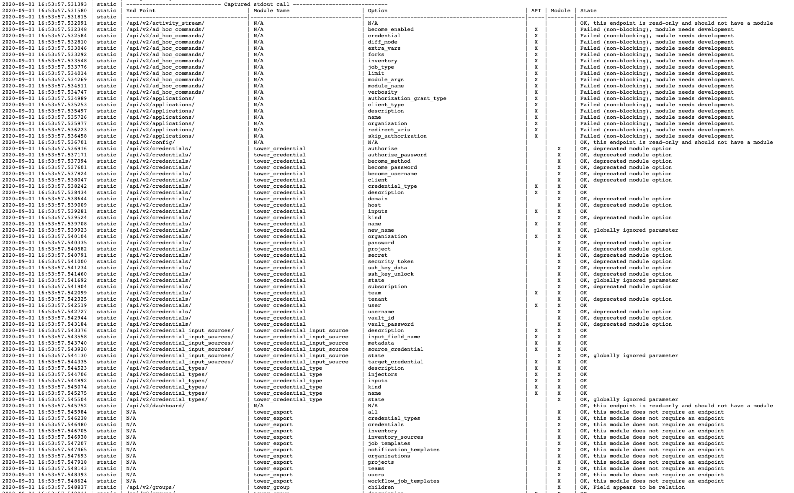

## Submitting an Enhancement

The AWX Collection is open source and we are always looking for help in maintaining and enhancing it. If you would like to contribute to the collection, there are several ways you can help, e.g., filing issues, reviewing documentation, and requesting enhancements. In addition, you can also create pull requests in GitHub if you have an enhancement or bug fix you would like to contribute. In this section we will discuss how you can create a pull request.

First we want to fork the AWX repository. Log in to GitHub and go to the `ansible/awx` repository ([https://github.com/ansible/awx](https://github.com/ansible/awx)). In the upper left hand corner click on the fork button:




Follow the directions on the next screen to create a fork of AWX in your personal space. Once the forking process is complete you will be directed to your fork.

The next task is to clone your repository onto the local machine:

```
[student1@ansible-1 ~]$ git clone https://github.com/john-westcott-iv/awx
Cloning into 'awx'...
remote: Enumerating objects: 254159, done.
remote: Total 254159 (delta 0), reused 0 (delta 0), pack-reused 254159
Receiving objects: 100% (254159/254159), 230.03 MiB | 47.72 MiB/s, done.
Resolving deltas: 100% (196199/196199), done.
[student1@ansible-1 ~]$ cd awx
```

Your fork will start with the default `devel` branch. This can be confirmed with:

```
[student1@ansible-1 awx]$ git branch
* devel
```

Now, create a branch with a meaningful name for your work with the command:

```
[student1@ansible-1 awx]$ git checkout -b fix_collection_bug
Switched to a new branch 'fix_collection_bug'
```

If working on an existing module, create a unit and or integration test for your work if possible. Commit your code as you work on things. When you are ready, push your changes up to your fork with the command:

```
[student1@ansible-1 awx]$ git push --set-upstream origin fix_collection_bug
git push --set-upstream origin fix_collection_bug
Total 0 (delta 0), reused 0 (delta 0)
remote:
remote: Create a pull request for 'fix_collection_bug' on GitHub by visiting:
remote:      https://github.com/john-westcott-iv/awx/pull/new/fix_collection_bug
remote:
To github.com:john-westcott-iv/awx.git
 * [new branch]            fix_collection_bug -> fix_collection_bug
Branch 'fix_collection_bug' set up to track remote branch 'fix_collection_bug' from 'origin'.
```

Notice in the results of the push (highlighted in red above) a URL is provided to you for initiating a pull request. Visit that URL in a browser, this will bring you to a summary screen:




Be sure your PR title is descriptive. If this is an initial commit and you are going to continue working on it, prefix the PR with “[WIP]” which stands for Work In Progress (or you can set your pull request to “Draft” mode).

Next, we need to fill out some information on the form:  

- Give your PR a good summary; this lets people know what you are doing and why. You don’t need to duplicate code inside the summary. If you are making a change in reference to a bug, place the bug number somewhere in it.
- Under “Issue Type” select which type of issue you are creating.
- Under “Component Name” delete the text that is there and replace it with:

  `- Collection`

- If you have any steps that explain how to reproduce your issue, you can add them in the “Additional Information” section.
- Finally, the `make VERSION` command as described and copy the results (which will look like `awx: 14.1.0`) and paste the content in between the two \`\`\` tags.

Below is an example of a PR form:

```
    ##### SUMMARY
    <!--- Describe the change, including rationale and design decisions -->
    Modify the collection to make me a sandwich.
    Fixes issue #12345.

    <!---
    If you are fixing an existing issue, please include "related #nnn" in your
    commit message and your description; but you should still explain what
    the change does.
    -->

    ##### ISSUE TYPE
    <!--- Pick one below and delete the rest: -->
     - Feature Pull Request

    ##### COMPONENT NAME
    <!--- Name of the module/plugin/module/task -->
     - Collection

    ##### AWX VERSION
    <!--- Paste verbatim output from `make VERSION` between quotes below -->
    ```
    awx: 14.1.0
    ```

    ##### ADDITIONAL INFORMATION
    <!---
    Include additional information to help people understand the change here.
    For bugs that don't have a linked bug report, a step-by-step reproduction
    of the problem is helpful.
      -->

    <!--- Paste verbatim command output below, e.g. before and after your change -->
    ```

    ```
```

Once you are done, click the green “Create Pull Request” button. This will open the pull request, issuing you a PR number. Once your PR is created, many things will begin to happen. First, the collections team will start to pick up your request and review your submission. Should any changes need to be made, a dialog will happen through the conversation tab of your PR.

Second, an automated process will begin to check your work. AWX uses a product called Zuul for Continuous Integration (CI). Zuul will be notified of your PR and will begin to scan and test your code. The most important checks will be:

- **sanity checks** including `flake8` and `pylint` processes which will validate that your code is in good syntactic order

- **API compliance** which looks at the `devel` version of the Ansible Tower API and validates that the Ansible modules address all endpoints and options within the endpoint

When Zuul is done checking your code it will automatically post the results for you in the conversation tab:




Here we see an example of a PR which was able to pass the API compliance check (awx-ansible-modules) but failed the basic linting (awx-api-lint). Clicking on the link will bring you to a page showing you the logs from the linting process:




Select the `job-output.txt.gz` to see the log in text format. Warning, these logs can be very large and daunting at first. A good way to find your problem is to search for the keyword “error” or “fail”. Here is the error with linting:




In this case, the error states (slightly trimmed down):

```
./awx_collection/tests/integration/targets/tower_lookup_api_plugin/tasks/main.yml
  39:22     warning  truthy value should be one of [false, true]  (truthy)
```

This is telling us that in the `main.yml` file of the `tower_lookup_api_plugin` on line 39 column 22 we have a truth value that is not in the correct case.

To remediate this problem, update the code on your fork and push the commit to your branch. This will automatically update your PR and re-run the tests.

The completeness check is actually run from the unit tests and can be found in `awx_collection/tests/awx/test_completness.py`. Again, this is comparing the CRUD modules to the API endpoints and looking for discrepancies in options between the two. For example, if you were creating a module for an endpoint and the module had parameters A, B and C, and the endpoint supported options A, B and D, then you would get errors around parameter C and option D being mismatched. A completeness failure will generate a large ASCII table in the Zuul log indicating what is going on:




To find your error, look at the last column and search for the term “failure”. There will most likely be some failures which have been deemed acceptable and will typically say “non-blocking” next to them. Those errors you can safely ignore.

Once the PR is in order and all comments and issues are resolved, your change may get merged into the source code of AWX.  
